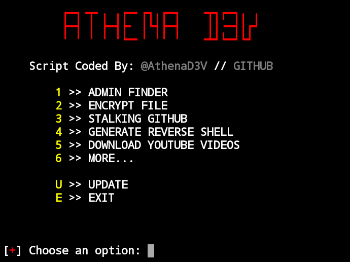

### Instalação

<pre>
<code>
  apt-get install git
  apt-get install python
  git clone https://AlbaniaSecurity/AthenaForever
</code>
</pre>

### Execução
<pre>
<code>
  cd AthenaForever
  chmod +x AthenaD3V
  ./AthenaD3V
</code>
</pre>
